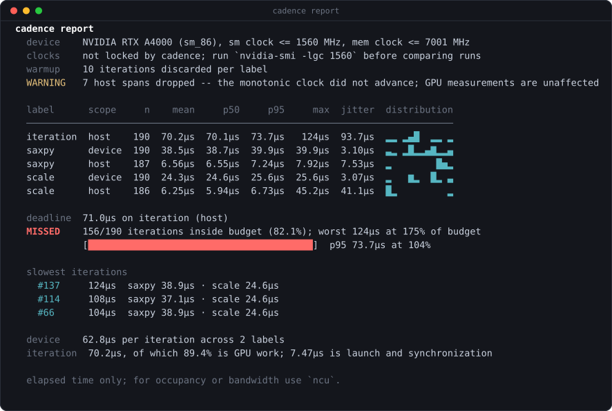
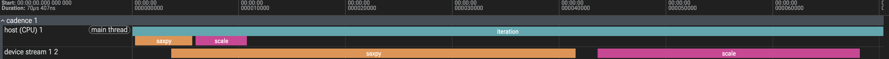

# cadence

Time the stages of a CUDA loop from inside your own process. Header-only, C++17.


[](https://github.com/donald-heddesheimer/cadence/actions/workflows/ci.yml)
[](https://codecov.io/gh/donald-heddesheimer/cadence)
[](LICENSE)
[](https://en.cppreference.com/w/cpp/17)
[](include/cadence)

Wrap the stages you care about and run the application normally. cadence prints
latency distributions when the process exits. The instrumentation is compiled
into the binary, so it can measure ordinary runs without a separate profiler or
capture step.

## Quick start

```cpp
#include <cadence/cadence.h>

while (running) {
  CADENCE_SCOPE("iteration");                                 // CPU span

  { CADENCE_KERNEL("saxpy", stream); Saxpy<<<...>>>(...); }   // GPU span
  { CADENCE_KERNEL("scale", stream); Scale<<<...>>>(...); }

  cudaStreamSynchronize(stream);
  CADENCE_FLUSH();          // once per iteration, never between scopes
}
CADENCE_REPORT();
```



Reading it:

- **Two rows per label.** `device` is GPU execution measured with CUDA events;
  `host` is CPU time spent issuing the work. When they converge, the stage is
  launch-bound rather than compute-bound.
- **The distribution column** exposes outliers that a mean can hide.
- **The deadline line** reports how many iterations exceeded the budget.
- **The slowest iterations** retain their stage breakdowns for diagnosis.

## How it stays out of the way

cadence records CUDA events without synchronizing each scope. It resolves them
later at an application synchronization boundary, avoiding a blocking read on
every measurement.

Buffers are thread-local, so threads do not contend; statistics are folded in
with Welford's method and a sample reservoir, so a loop running for a week costs
the same memory as one running for a minute.

## Timelines

Set `tracePath` and the same retained iterations are written as Chrome Trace
Event JSON, which [ui.perfetto.dev](https://ui.perfetto.dev) opens directly:

```cpp
cfg.tracePath = "worst.json";   // or: CADENCE_TRACE=worst.json ./app
```



The trace uses one CPU lane and one lane per CUDA stream on a shared clock. In
the example, `scale` was queued at 10µs and started on the GPU at 43µs. Only the
retained slow iterations are exported, keeping the trace small enough to inspect.

## Where it fits

| | Answers | How you run it | Live loop? |
|---|---|---|---|
| **cadence** | which stage got slow, and how much it varies | `#include` it; ships in your binary | yes, by design |
| Nsight Systems | what the whole system did over a few seconds | launch under `nsys`, open the capture | one-off investigation |
| Nsight Compute | why one kernel is slow, to hardware counters | `ncu`, which replays each kernel | no, orders of magnitude slower |
| nvbench | how a kernel scales across a parameter sweep | a separate benchmark binary | no, measures kernels not your app |
| Hand-rolled `cudaEvent` | the measurements you implement | application code | a blocking implementation measured 6.5µs per scope versus cadence's 3.4µs |

cadence complements the Nsight tools. Use it to find *when and where* you got
slow, then `nsys` or `ncu` for *why*. Every scope also emits an NVTX range, so
the same instrumentation shows up on the Nsight timeline for free.

## Features

- **Distributions, not averages.** mean, min, p50, p95, max, stddev, jitter.
- **Bounded sampling.** Past the retention cap, count, mean, stddev, min, max,
  and deadline results remain exact. Percentiles and histograms are estimated
  from a uniform sample of the full run. `sampleEvery` is a separate trade: it
  measures one iteration in N, so every figure, the deadline count included,
  describes the sampled iterations rather than the whole run.
- **Color for interactive output.** Auto-detected and disabled by `NO_COLOR`;
  redirected output and `outputPath` remain plain text.
- **CPU and GPU through one API.** Host timers compile in translation units with
  no CUDA in them.
- **A row per GPU.** A process driving several cards gets one row each and a `dev`
  column to tell them apart, which appears only when there is more than one.
- **Compiles to nothing.** `-DCADENCE_DISABLE` removes every macro without
  leaving a runtime branch behind.
- **Provenance in the output.** Device, clock ceilings, warmup, sampling rate and
  any dropped records, so a number traces back to the run that produced it.
- **Header-only.** No third-party dependencies, MIT licensed.

## Install

```cmake
add_subdirectory(cadence)                              # vendored
target_link_libraries(my_app PRIVATE cadence::cadence)
```

```cmake
include(FetchContent)                                  # fetched
FetchContent_Declare(cadence
  GIT_REPOSITORY https://github.com/donald-heddesheimer/cadence.git
  GIT_TAG        v0.2.0)
FetchContent_MakeAvailable(cadence)
target_link_libraries(my_app PRIVATE cadence::cadence)
```

Or copy `include/cadence` onto your include path and skip CMake entirely.

## API

| Macro | Measures | ns/scope |
|---|---|---:|
| `CADENCE_KERNEL("label", stream)` | GPU span, paired CUDA events | 3390 |
| `CADENCE_STAGE("label", stream)` | GPU span, one event, chained to the previous stage | 2410 |
| `CADENCE_SCOPE("label")` | CPU span, `steady_clock` | 330 |
| `CADENCE_FLUSH()` | resolves pending records; synchronizes | once per loop |
| `CADENCE_REPORT()` | flush, then print the report | once per run |

`stream` is optional and defaults to the default stream.

```cpp
cadence::Config cfg;
cfg.warmupIterations = 10;      // discard context creation, JIT, cuBLAS autotuning
cfg.budgetMs = 0.080;           // deadline for one stage; 0 disables the check
cfg.budgetLabel = "";           // which stage; empty picks the loop span
cfg.numWorstIterations = 3;     // slowest iterations kept whole; 0 turns it off
cfg.tracePath = "worst.json";   // Perfetto-openable timeline of those iterations
cfg.sampleEvery = 1;            // measure one iteration in N
cfg.maxSamplesPerLabel = 32768; // retained per row; 0 keeps every observation
cfg.outputPath = "run.txt";     // also write the report here
cfg.reportStream = &std::cerr;  // where it prints; nullptr suppresses printing
cfg.unicodeOutput = false;      // ASCII table for terminals that mangle UTF-8
cfg.colorOutput = cadence::ColorMode::Auto;  // Color terminal output automatically
cadence::Configure(cfg);

std::vector<cadence::Stats> rows = cadence::Snapshot();   // assert on these in tests
std::vector<cadence::TraceIteration> worst = cadence::WorstIterations();
```

Every field has an environment override (`CADENCE_WARMUP`, `CADENCE_BUDGET_MS`,
`CADENCE_TRACE`, `CADENCE_ENABLE`, ...), so a deployed binary can be re-pointed
without a rebuild. Set the budget before the loop starts: misses are counted as
observations arrive, which is what keeps the verdict exact on a long run.

## Overhead

Best difference over 7 x 50,000 scopes on an RTX A4000. Most of the
`CADENCE_KERNEL` cost comes from CUDA timestamped events; the same call with
`cudaEventDisableTiming` costs 153 ns. About 200 ns per device scope covers the
CUDA graph capture guard and the device query used to keep events on their
originating GPU.

| | ns/scope | |
|---|---:|---|
| `CADENCE_KERNEL` | 3390 | two `cudaEventRecord` calls |
| `CADENCE_STAGE` | 2410 | one event, chained |
| `CADENCE_KERNEL`, 1 in 10 | 367 | sampled |
| `CADENCE_SCOPE` | 330 | two `steady_clock` reads |
| NVTX passthrough | ~10 | with no tool attached |

Wrap stages, not individual small kernels. Below roughly 50 µs of GPU work per
scope the instrumentation becomes a visible fraction of the result.

Compared with a blocking implementation that records around a launch and then
calls `cudaEventSynchronize`, cadence costs about half as much per scope. Across
50,000 launches, the blocking version measured 3.7x the uninstrumented wall
clock and cadence measured 2.7x. Deferred resolution preserves more CPU/GPU
overlap as kernel duration increases.
[docs/overhead.md](docs/overhead.md) has the measurements behind this.

The [llama.cpp case study](docs/case-study.md) cross-checks that result against a
real CUDA backend. Two configurations measured 3044 and 3227 ns per scope;
instrumenting every graph node reduced throughput by 20%, while graph-level
instrumentation had no measurable cost.

## Build and test

```sh
cmake -B build && cmake --build build -j
ctest --test-dir build --output-on-failure
```

Host, disabled-build and self-contained-header tests need no GPU and no CUDA
toolkit. Device tests build when `nvcc` is found and skip themselves when no
device answers.

`examples/` contains a standalone CUDA loop and a [ROS 2 node](examples/ros2)
whose callback budget matches its timer period. The ROS 2 package builds with
colcon and remains outside the main build and CI.

## What it does not do

Elapsed time only, through the CUDA runtime API: hardware counters are `ncu`'s
job, system-wide timelines are `nsys`'s.

Work captured into a CUDA graph is not measured. A `cudaEventRecord` issued into
a capturing stream is baked into the graph rather than executed, which makes the
event permanently unreadable and, if a flush lands before the capture closes,
invalidates the capture itself. Scopes on a capturing stream therefore record
nothing and the report says how many stood down. Wrap the graph launch instead.

Per-device rows and multi-GPU report behavior have unit coverage, but have only
been run on single-GPU hardware. Live multi-GPU behavior is therefore not yet
validated.

## License

MIT
